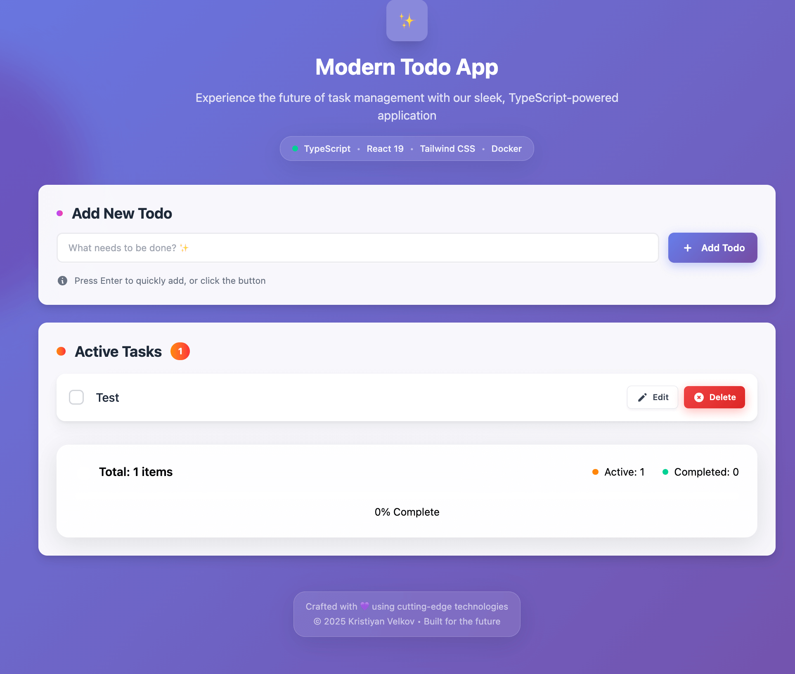

# Docker Node.js Sample Project

This project demonstrates how to effectively containerize a modern full-stack Node.js application using Docker for both **development** and **production** workflows.

<div align="center">
  
</div>

It is used as part of the [official Docker Node.js sample](https://docs.docker.com/guides/nodejs), showcasing industry best practices for full-stack containerization—including secure builds, streamlined development workflows, and optimized production delivery.

## 🚀 Features

- **Full-Stack Architecture**: Express.js 5.x backend with React 19 frontend
- **Modern Tech Stack**: TypeScript, Vite, Tailwind CSS 4, PostgreSQL 16.10
- **Fast Build System**: esbuild for lightning-fast server builds (12KB output)
- **Database**: PostgreSQL with automatic connection handling and health checks
- **Development Experience**: Hot reload, file watching, automatic database startup
- **Production-Ready**: Multi-stage Docker builds, security hardening, resource management
- **Comprehensive Testing**: 101 passing tests with Vitest and React Testing Library
- **Docker Optimized**: Separate development/production configurations with proper networking
- **CI/CD Ready**: GitHub Actions workflows, Kubernetes deployment configurations

## 🏃‍♂️ Quick Start

### Prerequisites

- [Docker Desktop](https://www.docker.com/products/docker-desktop/)
- [Node.js 22+](https://nodejs.org/) (for local development)
- [Git](https://git-scm.com/)

### Run with Docker (Recommended)

```bash
# Clone the repository
git clone https://github.com/kristiyan-velkov/docker-nodejs-sample
cd docker-nodejs-sample

# Start development with smart file watching
docker compose up app-dev --watch

# Or start normally without watch
docker compose up app-dev

# Access the application
# Frontend: http://localhost:5173 (Vite dev server)
# API: http://localhost:3000 (Express server)
# Health Check: http://localhost:3000/health
```

### Production & Testing

```bash
# Production mode (optimized build, single port)
docker compose --profile prod up app-prod --build

# Access production app
# Full-stack app: http://localhost:8080 (serves both API and frontend)
# Health Check: http://localhost:8080/health

# Run comprehensive test suite
docker compose --profile test up app-test --build

# Database operations
docker compose --profile local up db-local -d  # Local database only
```

### Run Locally

For local development with your IDE:

```bash
# Install dependencies
npm install

# Option 1: Start database + app together
npm run dev:with-db

# Option 2: Manual database control
npm run db:start    # Start PostgreSQL container
npm run dev         # Start app (requires database running)

# Access the application
# Frontend: http://localhost:5173
# API: http://localhost:3000
# Debugger: localhost:9230 (Node.js inspector)
```

**How it works**:

- `npm run dev:with-db` starts PostgreSQL container then the app
- `npm run dev` expects PostgreSQL to be already running
- When running in Docker Compose, it uses the existing database service
- Vite dev server is configured with `host: '0.0.0.0'` for Docker compatibility

### Manual Database Control

```bash
# Start database only
npm run db:start

# Stop database
npm run db:stop

# View database logs
npm run db:logs
```

### Troubleshooting Database Connection

```bash
# Check if database is running
docker ps | grep todoapp-db-local

# View database logs
npm run db:logs

# Reset database
npm run db:stop && npm run db:start
```

### Run Tests in Docker

```bash
# Run all tests
docker compose run --rm test

# Run tests with coverage
docker compose run --rm app npm run test:coverage
```

## 🔧 Build System

This project uses **esbuild** for fast, efficient server builds:

### Build Configuration

```bash
# Server build (esbuild)
npm run build:server    # Outputs to dist/server.js (12KB)

# Client build (Vite)
npm run build:client    # Outputs to dist/client/

# Full build
npm run build          # Builds both server and client
```

### esbuild Features

- **Lightning Fast**: 10-20ms build times
- **ESM Output**: Modern ES modules for Node.js 22
- **External Packages**: Dependencies not bundled (smaller output)
- **Source Maps**: Full debugging support
- **Production Optimized**: Minification enabled in production

### Build Output Structure

```
dist/
├── client/           # Vite-built React app
│   ├── index.html
│   └── assets/
└── server.js         # esbuild-bundled Express server (12KB)
```

## 🏗️ Architecture

### Development Mode

- **Frontend**: Vite dev server on port 5173 with HMR
- **Backend**: Express server on port 3000 with hot reload
- **Database**: PostgreSQL on port 5432
- **Debugging**: Node.js inspector on port 9229

### Production Mode

- **Single Port**: Express serves both API and static files on port 3000 (container), accessible on port 8080 (host)
- **Optimized**: Minified builds, security headers, resource limits
- **Static Files**: React app served from `/dist/client/`
- **API Routes**: Available at `/api/*`
- **SPA Support**: Catch-all routing for React Router

### Express 5.x Compatibility

- Updated route patterns for compatibility
- Modern middleware configuration
- Enhanced security defaults

## 📚 Documentation

- **[Development Guide](docs/DEVELOPMENT.md)** - Local development setup and workflows
- **[Build System](docs/BUILD_SYSTEM.md)** - esbuild configuration and architecture
- **[Deployment Guide](docs/DEPLOYMENT.md)** - Production deployment strategies
- **[Kubernetes Config](nodejs-sample-kubernetes.yaml)** - Production-ready K8s deployment

**Author**

- [Kristiyan Velkov](https://www.linkedin.com/in/kristiyan-velkov-763130b3/)
- [Blog - Medium](https://medium.com/@kristiyanvelkov)
- [Front-end World Newsletter](https://kristiyanvelkov.substack.com)

---

## Security

This Docker image has been thoroughly scanned for vulnerabilities to ensure a secure environment for your Node.js application. The image has passed all vulnerability assessments using Docker's built-in security tools, including Docker Scout. Regular updates to the base image and dependencies are recommended to maintain a high level of security.

---

### 📌 Contribution

Contributions are always welcome, whether it's reporting issues, improving documentation, fixing bugs, or adding new features. This project is for everyone! 💙
And yes, it's open-source! 🎉

---

### 📬 Contact

Feel free to reach out to me on [LinkedIn](https://www.linkedin.com/in/kristiyan-velkov-763130b3/) or [Medium](https://medium.com/@kristiyanvelkov).

---

### ☕ Support My Work

If you find my work helpful and would like to support me, consider donating via:

- [Revolut](https://revolut.me/kristiyanvelkov)
- [Buy Me a Coffee](https://www.buymeacoffee.com/kristiyanvelkov)
- [GitHub Sponsors](https://github.com/sponsors/kristiyan-velkov)

Your support helps me continue creating valuable content for the community. Thank you! 🚀

---

### License

This project is licensed under the MIT License.
